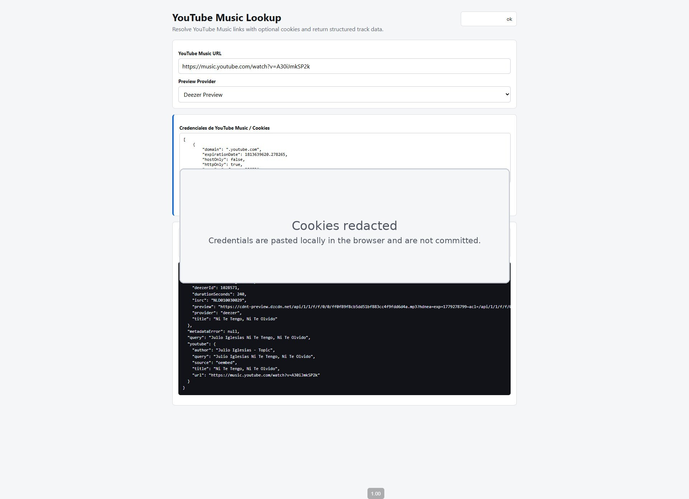

# Shazam Popular Segments

Prototype for finding the most popular Shazam segment of a song and extracting a short audio clip for automated video workflows.

## Goal

Given a song, produce:

- stable song metadata: title, artist, ISRC, duration
- Shazam Popular Segments timestamps
- a short extracted clip, usually 5s from Shazam or 7s for video use

## Workspace Layout

- `docs/` - project notes and design decisions
- `data/cases/` - per-song metadata and extracted structured data
- `inputs/screenshots/` - Shazam screenshots or visual source material
- `outputs/clips/` - generated audio clips ready for review/use
- `scripts/` - prototype scripts
- `notes/` - working notes, logs, experiments

## Install

Requirements:

- Linux server or workstation
- `git`
- `ffmpeg`
- `bash`
- Python 3.10+

Clone:

```bash
git clone https://github.com/jesustorres-code/shazam-popular-segments.git
cd shazam-popular-segments
```

Install system dependency on Ubuntu/Debian:

```bash
sudo apt-get update
sudo apt-get install -y ffmpeg
```

Install the CLI:

```bash
python3 -m pip install --user .
```

## Usage

Extract a clip from a local audio file:

```bash
shazam-segment extract --audio input.mp3 --start 0 --duration 5 --output outputs/clips/example-00-05.mp3
```

Arguments:

- `input.mp3` - source audio
- `0` - start time in seconds
- `5` - clip duration in seconds
- `outputs/clips/example-00-05.mp3` - output file

For a Shazam Popular Segment shown as `00:00 - 00:05`, use:

```bash
shazam-segment extract --audio input.mp3 --start 00:00 --end 00:05 --output outputs/clips/song-popular-00-05.mp3
```

For a 7-second video clip starting at the same point:

```bash
shazam-segment extract --audio input.mp3 --start 00:00 --duration 7 --output outputs/clips/song-video-00-07.mp3
```

Extract from a case JSON file:

```bash
shazam-segment extract \
  --audio input.mp3 \
  --case data/cases/holanda/metadata.json \
  --output outputs/clips/holanda-popular.mp3
```

Search metadata:

```bash
shazam-segment metadata "EL DE LA TINTA Sahir Montoya holanda" --provider deezer
```

Create a reusable case:

```bash
shazam-segment case create \
  "EL DE LA TINTA Sahir Montoya holanda" \
  --shazam-url "https://www.shazam.com/track/..." \
  --segment-start 00:00 \
  --segment-end 00:05
```

Extract both the exact popular clip and the 7-second video clip:

```bash
shazam-segment case extract data/cases/el-de-la-tinta-holanda/metadata.json
```

Run the HTTP API:

```bash
python3 -m pip install --user '.[api]'
shazam-segment serve --host 0.0.0.0 --port 8000
```

See `docs/api.md` for endpoint examples.

Open the dashboard:

```bash
http://127.0.0.1:8000/
```

The dashboard can list generated clips, play them in-browser, and download them as MP3 files.

For YouTube Music links, paste the URL in the YouTube Music tab. If public metadata is incomplete, paste browser-exported YouTube cookies in Netscape `cookies.txt` format or as a raw `Cookie:` header; the API uses them only for that one request and does not save them.

### Flask YouTube Music Downloader

The Flask downloader runs on port 7777 and supports YouTube Music lookup, editable browser-local cookies, preview metadata, and full-audio download through `yt-dlp`.



See [docs/flask-youtube-music.md](docs/flask-youtube-music.md) for setup and API details.

The "Direct Run" tab separates URL lookup from clip extraction:

1. Use "Find Song" with a song query or Shazam URL. If Song Query is empty, it derives a search query from the Shazam URL slug.
2. Upload a Shazam screenshot and use "Read Segment" to OCR the Popular Segment from the top-right area.
3. Keep Shazam Segment Start/End and Video Seconds at zero until a real Popular Segment timestamp is available.
4. Use "Run Full Process" only after setting a real Shazam Segment Start/End and video duration.
5. Store the Shazam URL when provided, create the case JSON, extract clips, and show playback/download controls.

## Current Case

Song: `holanda`
Artists: `EL DE LA TINTA, Angel Cervantes, Sahir Montoya`
ISRC: `MXUM72503506`
Duration: `03:44` / `224s`
Shazam Popular Segment: `00:00 - 00:05`
Video Clip Candidate: `00:00 - 00:07`

## Current Outputs

- `outputs/clips/holanda-popular-00-05.mp3`
- `outputs/clips/holanda-video-00-07.mp3`

Generated clips and screenshots are kept locally and ignored by Git by default. They may contain third-party copyrighted media or service UI captures. Commit only metadata, docs, and source scripts unless there is a clear reason to version a specific artifact.

## Notes

Shazam blocks direct access from this server with `405 Not allowed`, even through Playwright/Chromium. The current reliable route is:

1. Get metadata from Deezer/iTunes/MusicBrainz or another stable source.
2. Use a Shazam screenshot or browser session from a reachable network.
3. Read `Popular Segments` text directly when available.
4. Fall back to visual timeline mapping only when timestamps are not shown.
5. Extract clips with `ffmpeg`.
